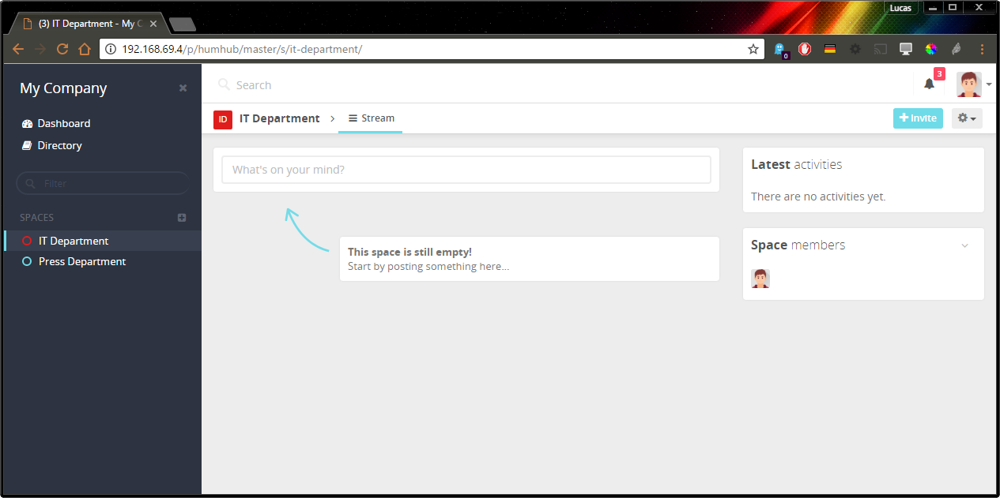

Enterprise - Theme
==================

Enable the Enterprise Theme
---------------------------

You can enable the **HumHub** Enterprise Edition - Theme by following steps:
- Navigate to: `Administration` -> `Settings` -> `Appearance`
- Select `enterprise` in the Theme dropdown menu
- Click `Save`

Theme Customization
-------------------

TBD