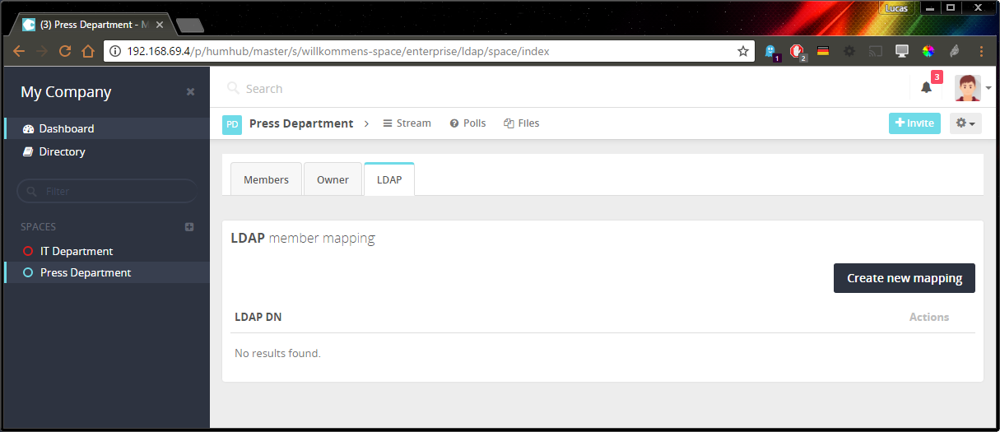
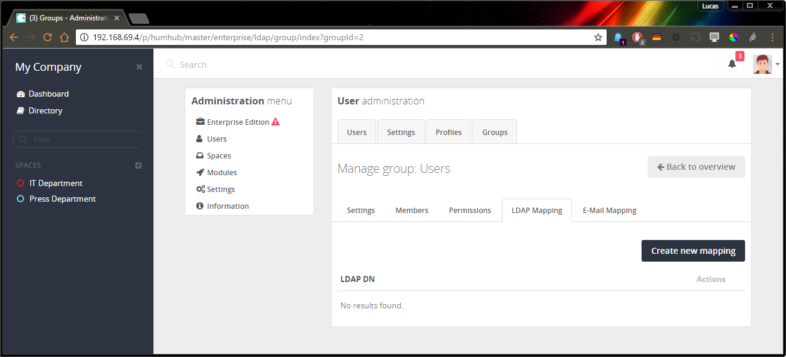

LDAP
====

The **HumHub** Enterprise Edition provides some advanced LDAP features.

Space Mapping
-------------

> Note: The mapping is handled by the hourly cron job and may takes some time to affect.

As administrative user, you can map a LDAP group directly to a space. 
All members of the given LDAP group are automatically assigned to the defined this.

Configuration page: `Open Space` -> `Members` -> `LDAP`

Group Mapping
-------------

> Note: The mapping is handled by the hourly cron job and may takes some time to affect.

As administrative user, you can map a LDAP group against HumHub groups which are mainly used for administrative tasks. 

Configuration page: `Administration` -> `Users` -> `Groups` -> `Select a group` -> `LDAP`

